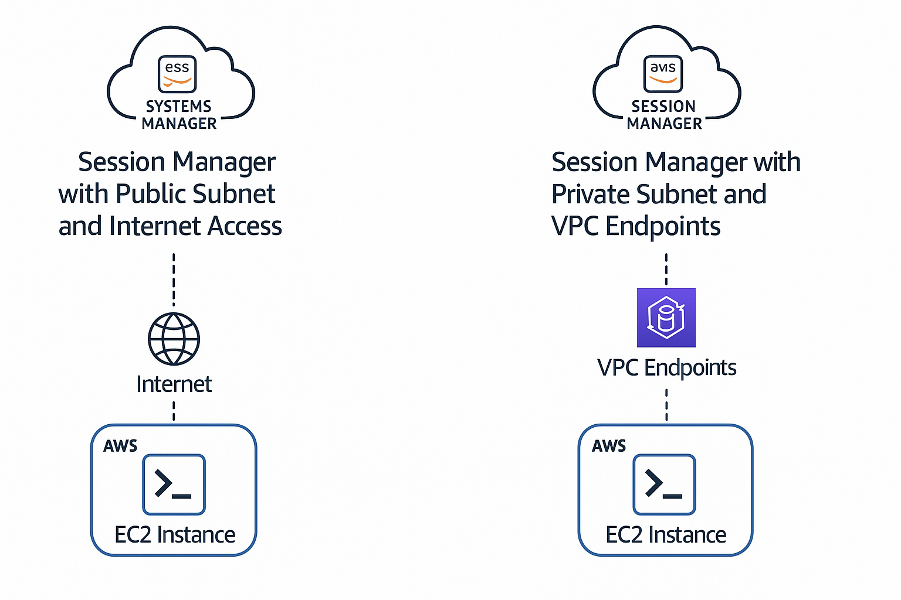

AWS Systems Manager Session Manager:

AWS Systems Manager Session Manager is a fully managed AWS service that allows you to securely connect to your EC2 instances, on-premises servers, and virtual machines without the need to open inbound ports, manage bastion hosts, or SSH keys.

🔑 Key Features of Session Manager
| Feature                    | Description                                                                                                            |
| -------------------------- | ---------------------------------------------------------------------------------------------------------------------- |
| **No SSH Needed**          | Connect to EC2 instances without SSH or RDP—purely through AWS console or CLI.                                         |
| **Secure Access**          | Uses **IAM roles/policies** for access control and **AWS KMS** for encrypting session data.                            |
| **Audit and Logging**      | Fully integrated with **AWS CloudTrail**, **Amazon S3**, and **Amazon CloudWatch Logs** for auditing session activity. |
| **Cross-Platform**         | Works with Linux and Windows instances.                                                                                |
| **Port Forwarding**        | Enables secure port forwarding (like tunneling to a database) over the session.                                        |
| **CLI and Console Access** | Access instances via **AWS CLI** (`start-session`) or directly from AWS Console.                                       |

✅ Benefits
No need to open ports (e.g., 22 or 3389)

No need to maintain SSH keys or bastion hosts

Centralized access control and session recording

Cost-effective and simplifies security posture

🧩 How It Works
Systems Manager Agent (SSM Agent) must be installed and running on the instance.

The instance needs an IAM Role with AmazonSSMManagedInstanceCore policy.

The instance must have internet access or VPC endpoints for Systems Manager.

📘 Example Use Cases
Troubleshooting EC2 instances in a private subnet

Secure access in regulated environments (e.g., PCI-DSS, HIPAA)

Automating admin tasks without remote login

Architecture:

